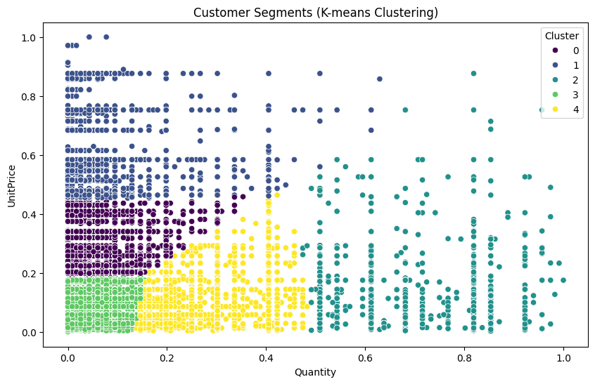
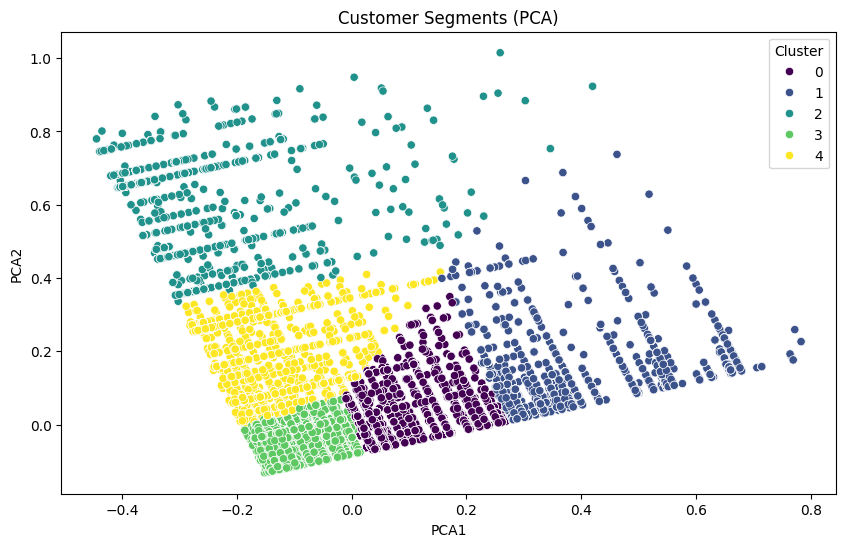
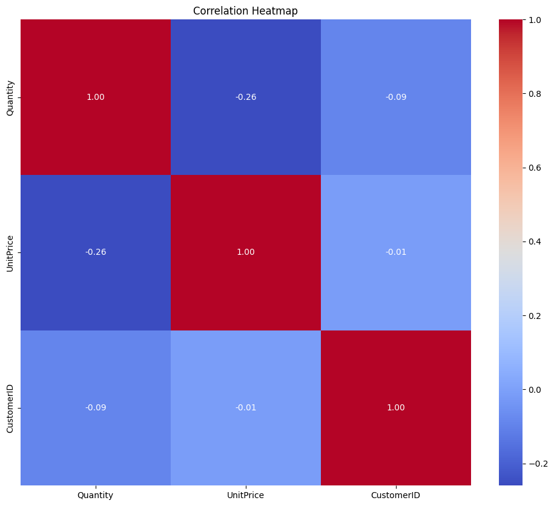

# Customer Segmentation for E-commerce Personalization

## Objective

This capstone project is designed to provide learners with practical experience in cleaning, scaling, and encoding data, ensuring it is well-prepared for unsupervised learning algorithms. The project emphasizes handling missing values, outliers, and duplicates. Learners will gain experience in evaluating clustering model performance, interpreting customer segments, and extracting actionable insights for personalized marketing strategies.

## Project Overview

In the competitive world of e-commerce, personalization is essential for retaining customers and increasing sales. This project leverages AI-driven customer segmentation to enhance personalization efforts. By analyzing customer data, including purchase history, browsing behavior, and demographic information, we can identify distinct customer segments. These segments allow businesses to tailor their marketing strategies, product recommendations, and overall customer interactions to meet the unique needs and preferences of each group.

### Key Features:
- **Data Preprocessing:** Cleaning and preparing the dataset for analysis, including handling missing values, outliers, and duplicates.
- **Feature Engineering:** Extracting meaningful features from raw data.
- **Clustering Algorithms:** Applying methods like K-means, hierarchical clustering, and DBSCAN to group customers into segments.
- **Evaluation Metrics:** Assessing segmentation quality using silhouette score and Davies-Bouldin index.
- **Visualization:** Presenting the results with informative visuals.

The outcome is a tool that helps e-commerce platforms provide a more targeted and relevant customer experience, thereby increasing customer satisfaction and conversion rates.

## Visualization






## Dataset

To access the dataset used in this project, please follow the link below:

[Customer Data for Segmentation](#)

*Note: Replace `#` with the actual URL to your dataset.*



## Getting Started

### Prerequisites
- Python 3.8 or higher
- Required libraries: `pandas`, `numpy`, `scikit-learn`, `matplotlib`, `seaborn`

### Installation

1. Clone this repository:
    ```bash
    git clone https://github.com/yourusername/customer-segmentation.git
    ```
2. Navigate to the project directory:
    ```bash
    cd customer-segmentation
    ```
3. Install the required packages:
    ```bash
    pip install -r requirements.txt
    ```

### Usage

1. Run the main analysis script:
    ```bash
    python main.py
    ```

2. To visualize the segmentation results, use the following code to display the analysis image:

    ```python
    import matplotlib.pyplot as plt

    # Assuming `image_path` is the path to your analysis image
    image_path = 'path/to/your/image.png'

    # Load and display the image
    img = plt.imread(image_path)
    plt.figure(figsize=(10, 6))
    plt.imshow(img)
    plt.axis('off')  # Hide the axis
    plt.show()
    ```

    *Note: Replace `'path/to/your/image.png'` with the actual path to your analysis image.*

## Results

The project identifies key customer segments within the dataset, providing insights into customer behavior and preferences. These insights can be directly applied to improve e-commerce personalization strategies.

## Conclusion and Recommendations

### Conclusion

The analysis successfully segmented customers into distinct groups based on their purchasing behavior. Each segment has unique characteristics that can be leveraged for targeted marketing and personalized recommendations.

### Recommendations

Future work could involve experimenting with different clustering algorithms and feature engineering to further refine the segments. By doing so, the segments could become even more precise, allowing for more accurate targeting and improved customer satisfaction.

## Contributing

If you'd like to contribute to this project, please fork the repository and use a feature branch. Pull requests are warmly welcome.


## Contact

For any questions or inquiries, please contact [pallavisikha122@gmail.com].
